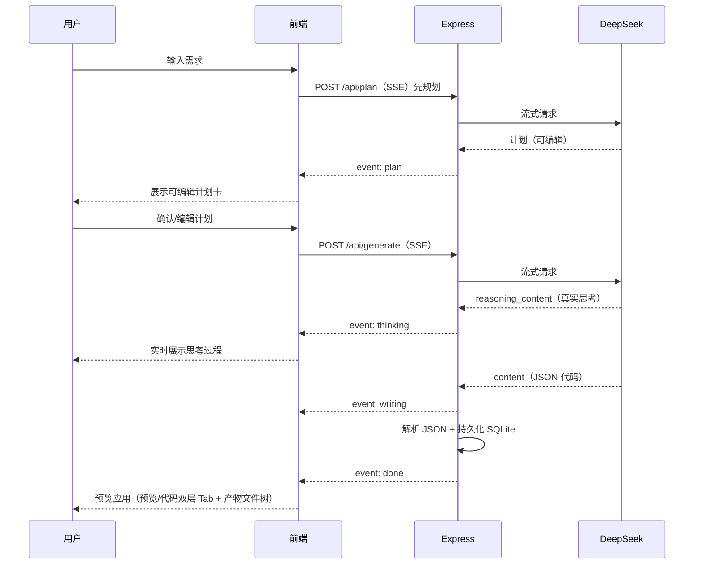

# Mini Atoms · AI 智能体应用生成平台

一个具备 Atoms 交互体验的 **AI 智能体驱动应用生成** Demo：用一句话描述需求，智能体（DeepSeek）生成完整可交互的网页应用，实时可视化预览，支持「先规划 → 确认 → 生成」的 Agent 流程、多智能体团队协作（Team Mode）、对话式迭代、一键发布为独立 URL 与产物导出。

> 技术栈：React 18 + Vite 5 + Node.js（Express）+ Node 内置 SQLite + DeepSeek（SSE 流式）

- **在线 Demo**：http://112.124.4.87:8082/
- **GitHub 源码**：https://github.com/lyb19850811/atoms-demo

---

## 功能特性

- 🤖 **智能体驱动生成**：自然语言 → DeepSeek 生成完整应用；支持 **单文件模式**（自包含 HTML）与 **团队模式**（多智能体流水线产出多文件工程）
- 🧠 **真实思考过程展示**：流式回传 `reasoning_content`，用户在界面上实时看到模型的思考，而非伪造的"正在生成"
- 📝 **先规划后执行**：生成前先产出可编辑的「开发计划」，用户确认（可修改）后才进入实际生成
- 👥 **团队模式（Team Mode）**：固定流水线 `产品经理 → 架构师 → 工程师` 协作，产出多文件项目（HTML/CSS/JS 等），每一步可见
- 🖥️ **三栏工作台**：`对话 | 预览 | 产物`；中间栏「预览 / 代码」两层 Tab（代码 Tab 内再嵌文件标签页），产物栏为文件树（20% 宽、可折叠）
- 💬 **对话式迭代**：基于上一版继续修改（改样式、加功能），保留未提及的原有功能
- 🚀 **独立发布**：一键发布为独立 URL（`/p/:id`），像真实部署的产品页，任何人可直接体验
- 📦 **产物导出**：一键下载生成产物为 ZIP（服务端零依赖打包）
- 🛡️ **安全防护**：接口限流 + 管理后台令牌鉴权 + 沙箱隔离生成代码
- 🎨 **明亮/暗色主题**：默认明亮，可切换并持久化
- 🧑 **轻量注册**：昵称即进入（演示流程，不做密码体系），支持退出登录
- ⏹ **停止生成**：生成中可一键中断（前端 AbortController + 后端流中断）

## 技术栈与选型理由

| 选择 | 理由 |
|------|------|
| React 18 + Vite 5 | 生态成熟、构建快；SPA 足够（工具型产品无 SEO 需求） |
| Node.js + Express | 单端口同时托管前端与 API，无 CORS，部署心智简单 |
| **Node 内置 `node:sqlite`** | 零原生依赖，本地（Node 24）/ 服务器（Node 22）行为一致，规避原生模块编译问题 |
| DeepSeek API | 国内直连、成本低、代码能力强；封装为可切换 provider，`deepseek-v4-flash`（推理）+ `deepseek-chat`（稳定回退） |
| SSE 流式 | 思考过程与代码逐块返回，交互感强；`fetch` + `ReadableStream` 前端解析，无需额外库 |
| HashRouter | 任意环境（IP:端口）下分享链接都可用，无需服务端路由回退 |
| 单文件 HTML 生成（默认） | 不服务端构建 React 工程，复杂度最低；`iframe srcdoc` 直接渲染 |

## 架构

```
┌──────────────────────────────────────────────────────────────┐
│  浏览器（React SPA）                                            │
│  落地页 → 注册 → 工作台(对话|预览|产物) → 我的应用 → 管理后台     │
└───────────────┬──────────────────────────────────────────────┘
                │ /api/*（同源，无 CORS；SSE 流式）
┌───────────────▼──────────────────────────────────────────────┐
│  Express 服务器                                                │
│  ├─ 静态托管前端 dist/                                         │
│  ├─ /api/users  注册/登录（昵称）                               │
│  ├─ /api/plan   规划（先规划后执行，可编辑确认）                  │
│  ├─ /api/generate 单文件生成/迭代（SSE）                        │
│  ├─ /api/team   团队模式：/plan 规划 + /build 流水线（SSE）      │
│  ├─ /api/apps   列表/详情/HTML/文件/下载/发布                    │
│  ├─ /api/admin  管理后台（X-Admin-Token 鉴权）                  │
│  └─ /p/:id      已发布应用的独立访问（mode 感知入口文件）         │
└───────┬──────────────────────────────┬───────────────────────┘
        │ node:sqlite                  │ HTTPS
┌───────▼─────────────┐      ┌─────────▼──────────┐
│  SQLite (data/)      │      │  DeepSeek API      │
│  users/apps/files/   │      │  deepseek-v4-flash │
│  steps/messages      │      │  (回退 deepseek-chat)│
└─────────────────────┘      └────────────────────┘
```

### 生成时序（Mermaid）



## 目录结构

```
atoms-demo/
├── server/
│   ├── index.js              # 入口：读取 .env 并监听端口
│   ├── app.js                # Express 应用（路由/中间件/静态托管，可测试）
│   ├── db.js                 # node:sqlite 初始化 + 迁移（users/apps/files/steps/messages）
│   ├── llm.js                # DeepSeek 流式 provider + 输出解析 + 冗长推理看门狗
│   ├── lib/
│   │   ├── team.js           # 团队模式流水线（leader 规划 + pm→architect→engineer 构建）
│   │   └── zip.js            # 零依赖 ZIP 打包（node:zlib crc32）
│   ├── middleware/
│   │   └── rateLimit.js      # 滑动窗口限流（每实例独立）
│   └── routes/
│       ├── users.js          # 注册/登录（昵称）
│       ├── plan.js           # /api/plan 规划（SSE）
│       ├── generate.js       # /api/generate 单文件生成/迭代（SSE）
│       ├── team.js           # /api/team/plan + /api/team/build（SSE）
│       ├── apps.js           # 列表/详情/HTML/文件/下载/发布
│       └── admin.js          # 管理后台（用户/应用管理）
├── src/
│   ├── api.js                # fetch + SSE 流式封装（含 5xx 重试）
│   ├── user.js               # localStorage 用户状态 + 首次引导标记
│   ├── theme.js              # 明亮/暗色主题持久化
│   ├── data/agents.js        # 智能体定义（含 @提及角色）
│   ├── lib/code.js           # 代码高亮（highlight.js）
│   ├── pages/                # Landing / Register / Workspace / Apps / AppView / Admin
│   ├── components/           # ChatPanel / PreviewPanel / ArtifactsPanel / FileTree /
│   │                         # FeatureMenu / UserMenu / PublishDialog / FirstRunGuide / Fireworks
│   └── __tests__/            # 前端测试（Vitest + Testing Library）
├── test/                     # 后端测试（node:test：API 集成 + LLM 单元）
├── deploy.sh                 # 一键部署脚本
├── vite.config.js            # 开发代理 /api → 3101
└── .env                      # DEEPSEEK_API_KEY 等（不入库，已被 .gitignore 忽略）
```

## 本地开发

```bash
npm install
npm run dev           # 前端 :5173 + 后端 :3101（代理 /api）
```

访问 http://localhost:5173

> 本地开发后端端口为 3101（避免与本机其他服务冲突），生产端口由 `.env` 的 `PORT` 决定。

## 测试

```bash
npm test              # node:test 运行后端测试（API 集成 7 + LLM 单元 8 = 15 个）
npm run test:web      # vitest 运行前端测试（8 个）
npm run test:all      # 全部测试
```

> 后端测试通过 `DATA_DIR` 环境变量隔离数据库，不影响真实数据。

## 生产构建与运行

```bash
npm run build         # 生成 dist/
npm start             # Express 同时托管 dist/ 与 /api
```

## 一键部署（deploy.sh）

```bash
./deploy.sh           # 测试 → 构建 → 上传 → pm2 重启 → 健康检查
```

> 脚本默认使用 SSH 别名 `aliyun-ecs`（`~/.ssh/config`），部署目录 `/opt/atoms-demo-improve`、pm2 名 `atoms-demo-improve`、端口 `8083`，与 main 分支（`/opt/atoms-demo` + `atoms-demo` + `8082`）完全隔离；按需修改脚本顶部配置。

## 部署到阿里云 ECS（已实践）

```bash
# 1. 上传源码（排除 node_modules/dist/data）
tar --exclude='./node_modules' --exclude='./dist' --exclude='./data' -czf src.tar.gz .
scp src.tar.gz root@<IP>:/tmp/

# 2. 服务器上解压并安装（国内用 npmmirror 镜像）
ssh root@<IP>
mkdir -p /opt/atoms-demo-improve && tar -xzf /tmp/src.tar.gz -C /opt/atoms-demo-improve
cd /opt/atoms-demo-improve
npm install --registry=https://registry.npmmirror.com
npm run build

# 3. pm2 守护启动（读取 .env 的 PORT）
pm2 start server/index.js --name atoms-demo-improve
pm2 save            # 保存进程列表
pm2 startup         # 可选：开机自启

# 4. ⚠️ 阿里云控制台 → ECS → 安全组 → 入方向，放行 TCP <PORT>
```

## 环境变量（.env）

| 变量 | 说明 | 默认值 |
|------|------|--------|
| `DEEPSEEK_API_KEY` | DeepSeek API Key（必填） | — |
| `DEEPSEEK_BASE_URL` | API 地址 | `https://api.deepseek.com` |
| `DEEPSEEK_MODEL` | 生成模型 | `deepseek-v4-flash` |
| `PORT` | 服务端口 | `8083` |
| `ADMIN_TOKEN` | 管理后台访问令牌 | — |
| `DATA_DIR` | SQLite 数据目录（测试隔离用） | `./data` |

## 核心 API

| 方法 | 路径 | 说明 |
|------|------|------|
| POST | `/api/users` | 昵称注册/登录，返回 `{id, nickname}` |
| POST | `/api/plan` | 单文件模式规划（SSE），返回可编辑计划 |
| POST | `/api/generate` | 单文件生成/迭代（SSE）：`{appId?, plan, prompt, userId?}` |
| POST | `/api/team/plan` | 团队模式规划（SSE，leader 拆解任务） |
| POST | `/api/team/build` | 团队模式构建（SSE，pm→architect→engineer 流水线） |
| GET | `/api/apps?userId=` | 某用户的应用列表 |
| GET | `/api/apps/:id` | 应用详情（含对话历史、步骤、文件） |
| GET | `/api/apps/:id/html` | 生成应用的原始 HTML（分享页 iframe 加载） |
| GET | `/api/apps/:id/files` | 应用产物文件列表（团队模式） |
| GET | `/api/apps/:id/download` | 下载产物 ZIP（`filename*=UTF-8''...`） |
| POST | `/api/apps/:id/publish` | 发布 / 取消发布，返回独立 URL `/p/:id` |
| GET | `/p/:id` | 已发布应用的独立访问地址（单文件返回 html，团队模式返回入口文件） |
| GET | `/api/admin/users` / `/api/admin/apps` | 管理后台查询（需 `X-Admin-Token` 头） |
| DELETE | `/api/admin/users/:id` / `/api/admin/apps/:id` | 管理后台删除（需 `X-Admin-Token` 头） |
| GET | `/api/health` | 健康检查 |

## 关键设计取舍

1. **生成「单文件 HTML」而非 React 工程（默认模式）**：避免服务端 `npm install` + 构建生成项目的高复杂度与高失败率；单文件 HTML 天然可交互、可分享、可在沙箱直接渲染。团队模式作为「扩展能力」，通过固定流水线产出多文件工程，兼顾工程思维与稳定性。
2. **先规划后执行**：生成前先产出可编辑计划并等待用户确认，符合真实 Atoms 的「需求澄清 → 确认 → 执行」交互，同时避免模型一次跑偏浪费 Token。
3. **沙箱隔离安全**：`<iframe sandbox="allow-scripts allow-forms allow-modals">`（不含 `allow-same-origin`）隔离生成代码；系统提示词同时约束生成代码不使用 localStorage / 网络请求。
4. **LLM Provider 抽象层**：`server/llm.js` 将模型调用与业务解耦，后续切换 Claude/OpenAI 只需改这一处。
5. **JSON 输出模式 + 冗长推理看门狗**：用结构化提示词（`【思考要求】…`）约束模型简洁思考并直接输出 JSON，另保留正则兜底解析；当推理内容过长（>3000 字）且正文为空时，自动回退到非推理模型 `deepseek-chat` 重试，避免「冗长思考卡死」。
6. **内置 SQLite 而非外部数据库**：零运维、零依赖，符合「可运行、可扩展原型」的定位。
7. **单端口部署**：Express 同时托管前端产物与 API，无 CORS、无跨域配置，`pm2` 守护。

## 后续扩展方向（按优先级）

1. **团队流水线自由编排 / function calling**：当前为固定 `pm→architect→engineer` 顺序，可演进为按任务类型动态编排、多智能体互相调用
2. **应用模板 / 画廊**：预设模板 + 社区分享，降低冷启动成本，形成内容飞轮
3. **真实账号 + 配额计费**：接入登录、按用户隔离的 Token 用量统计与计费
4. **生成应用部署为独立静态站点**：发布物托管到 CDN/对象存储，而非当前同源直接渲染
5. **产物在线编辑**：在产物文件树中直接编辑并回写，形成「生成 → 改 → 再生成」的完整闭环
