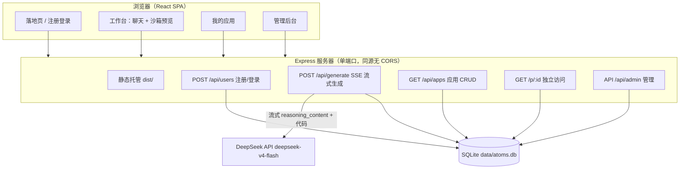
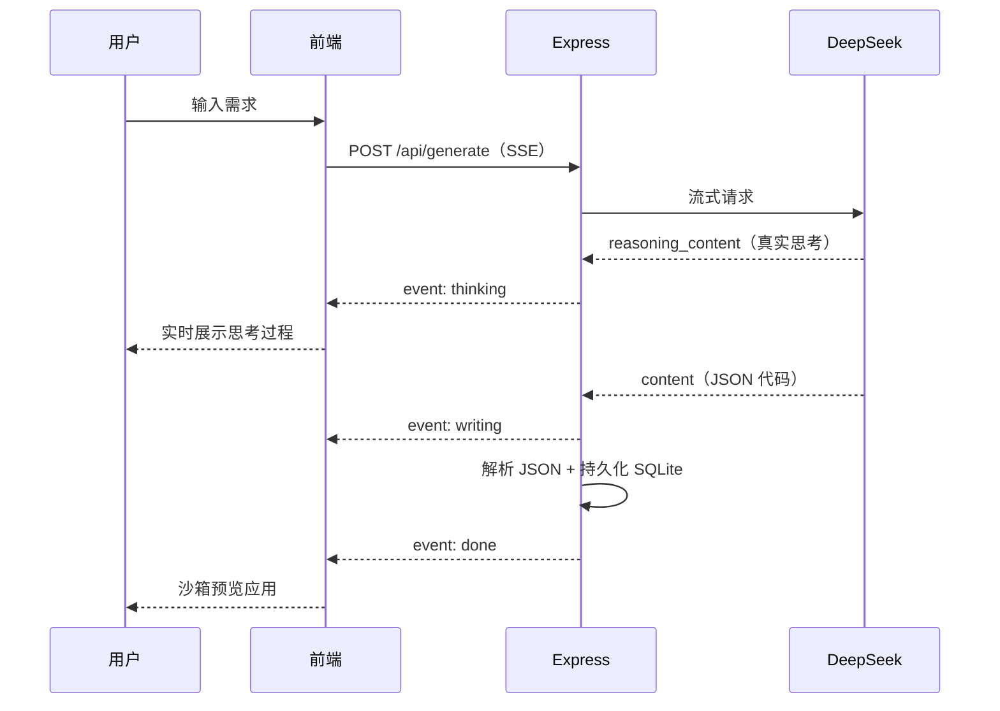

# Mini Atoms · AI 应用生成平台

一个具备 Atoms 交互体验的 **AI 智能体驱动应用生成** Demo：输入一句话需求，智能体生成完整可交互的单文件网页应用，并在沙箱中实时可视化预览，支持对话式迭代修改与一键分享。

> 技术栈：React + Vite + Node.js(Express) + SQLite(内置) + DeepSeek

---

## 功能特性

- 🤖 **智能体驱动生成**：自然语言描述 → DeepSeek 生成完整自包含的单文件 HTML 应用
- 🖥️ **沙箱可视化预览**：生成结果即时渲染在 `sandbox` iframe 中，桌面 / 移动端一键切换
- 💬 **对话式迭代**：基于上一版继续修改（改样式、加功能），保留未提及的原有功能
- 💾 **数据持久化**：用户 / 应用 / 对话历史落库 SQLite，刷新不丢失
- 🔗 **一键分享**：每个应用有独立公开链接，任何人可直接体验
- 🚀 **独立发布**：一键将生成应用发布为独立访问 URL（`/p/:id`），像真实部署的产品页
- 🎤 **语音输入**：浏览器语音识别，说出需求即可生成（Chrome / Edge）
- 🛡️ **安全防护**：接口限流 + 管理后台令牌鉴权
- 🧑 **轻量注册**：输入昵称即进入（演示流程，不做密码体系）

## 技术栈与选型理由

| 选择 | 理由 |
|------|------|
| React 18 + Vite | 熟悉、启动快；SPA 足够（工具型产品无 SEO 需求） |
| Node.js + Express | 单端口同时托管前端与 API，无 CORS，部署心智简单 |
| **Node 内置 `node:sqlite`** | 零原生依赖，本地（Node 24）/ 服务器（Node 22）行为一致，规避原生模块编译问题 |
| DeepSeek API | 国内直连、成本低、代码能力强；封装为可切换 provider |
| 单文件 HTML 生成 | 不服务端构建 React 工程，复杂度最低；`iframe srcdoc` 直接渲染 |
| HashRouter | 任意环境（IP:端口）下分享链接都可用，无需服务端路由回退 |

## 架构

```
┌────────────────────────────────────────────────────────┐
│  浏览器（React SPA）                                     │
│  落地页 → 注册 → 工作台(聊天+预览) → 我的应用 → 分享页     │
└───────────────┬────────────────────────────────────────┘
                │ /api/*（同源，无 CORS）
┌───────────────▼────────────────────────────────────────┐
│  Express 服务器                                          │
│  ├─ 静态托管前端 dist/                                    │
│  ├─ POST /api/users      注册（昵称）                     │
│  ├─ POST /api/generate   生成/迭代（核心闭环）             │
│  ├─ GET  /api/apps       应用列表/详情/原始 HTML           │
│  └─ lib/llm.js           DeepSeek provider 抽象层        │
└───────┬─────────────────────────────┬───────────────────┘
        │ node:sqlite                 │ HTTPS
┌───────▼───────────┐      ┌──────────▼─────────┐
│  SQLite (data/)    │      │  DeepSeek API      │
│  users/apps/msgs   │      │  deepseek-v4-flash │
└───────────────────┘      └────────────────────┘
```

### 架构图（Mermaid）



### 生成时序（Mermaid）



## 目录结构

```
atoms-demo/
├── server/
│   ├── index.js          # 入口：读取 .env 并监听端口
│   ├── app.js            # Express 应用（路由/中间件，可测试）
│   ├── db.js             # node:sqlite 初始化（users/apps/messages）
│   ├── llm.js            # DeepSeek 流式 provider 抽象层 + 输出解析
│   └── routes/
│       ├── users.js      # 注册/登录（昵称）
│       ├── generate.js   # 生成/迭代核心闭环（SSE）
│       ├── apps.js       # 应用列表/详情/发布/HTML
│       └── admin.js      # 管理后台（用户/应用管理）
├── src/
│   ├── api.js            # fetch + SSE 流式封装
│   ├── user.js           # localStorage 用户状态 + 引导标记
│   ├── pages/            # Landing / Register / Workspace / Apps / Admin
│   ├── components/       # ChatPanel / PreviewFrame / CodeViewer / Fireworks / …
│   └── styles.css        # 暗色主题
├── test/                 # node:test 测试（llm 单元 + API 集成）
├── deploy.sh             # 一键部署脚本
├── vite.config.js        # 开发代理 /api → 3101
└── .env                  # DEEPSEEK_API_KEY 等（不入库）
```

## 本地开发

```bash
npm install
npm run dev           # 前端 :5173 + 后端 :3101（代理 /api）
```

访问 http://localhost:5173

> 本地开发后端端口为 3101（避免与本机其他服务冲突），生产端口由 `.env` 的 `PORT` 决定。

## 测试

```bash
npm test             # node:test 运行 test/ 下的单元测试 + API 集成测试
```

## 生产构建与运行

```bash
npm run build         # 生成 dist/
npm start             # Express 同时托管 dist/ 与 /api
```

## 一键部署（deploy.sh）

```bash
./deploy.sh           # 测试 → 构建 → 上传 → pm2 重启 → 健康检查
```

> 脚本默认使用 SSH 别名 `aliyun-ecs`（`~/.ssh/config`），部署目录 `/opt/atoms-demo`；按需修改脚本顶部配置。

## 部署到阿里云 ECS（已实践）

```bash
# 1. 上传源码（排除 node_modules/dist/data）
tar --exclude='./node_modules' --exclude='./dist' --exclude='./data' -czf src.tar.gz .
scp src.tar.gz root@<IP>:/tmp/

# 2. 服务器上解压并安装（国内用 npmmirror 镜像）
ssh root@<IP>
mkdir -p /opt/atoms-demo && tar -xzf /tmp/src.tar.gz -C /opt/atoms-demo
cd /opt/atoms-demo
npm install --registry=https://registry.npmmirror.com
npm run build

# 3. pm2 守护启动（读取 .env 的 PORT）
pm2 start server/index.js --name atoms-demo
pm2 save            # 保存进程列表
pm2 startup         # 可选：开机自启

# 4. ⚠️ 阿里云控制台 → ECS → 安全组 → 入方向，放行 TCP <PORT>
```

## 环境变量（.env）

```bash
DEEPSEEK_API_KEY=sk-xxxxxxxx          # 必填
DEEPSEEK_BASE_URL=https://api.deepseek.com   # 可选
DEEPSEEK_MODEL=deepseek-chat          # 可选
PORT=8082                             # 可选，服务端口
ADMIN_TOKEN=atoms-admin-2026          # 可选，管理后台访问令牌（鉴权）
```

## 核心 API

| 方法 | 路径 | 说明 |
|------|------|------|
| POST | `/api/users` | 昵称注册，返回 `{id, nickname}` |
| POST | `/api/generate` | 生成/迭代：`{appId?, prompt, userId?}` → `{appId, title, html}` |
| GET | `/api/apps?userId=` | 某用户的应用列表 |
| GET | `/api/apps/:id` | 应用详情（含对话历史） |
| GET | `/api/apps/:id/html` | 生成应用的原始 HTML（分享页 iframe 加载） |
| POST | `/api/apps/:id/publish` | 发布 / 取消发布，返回独立 URL `/p/:id` |
| GET | `/p/:id` | 已发布应用的独立访问地址（直接返回应用 HTML） |
| GET | `/api/health` | 健康检查 |

## 关键设计取舍

1. **生成「单文件 HTML」而非 React 工程**：避免服务端 `npm install` + 构建生成项目的高复杂度与高失败率；单文件 HTML 天然可交互、可分享、可在沙箱直接渲染。代价是生成物无法使用前端框架生态，但对本场景已足够。
2. **沙箱隔离安全**：`<iframe sandbox="allow-scripts allow-forms allow-modals">`（不含 `allow-same-origin`）隔离生成代码，避免其读取主应用数据；系统提示词同时约束生成代码不使用 localStorage / 网络请求。
3. **LLM Provider 抽象层**：`server/llm.js` 将模型调用与业务解耦，后续切换 Claude/OpenAI 只需改这一处。
4. **内置 SQLite 而非外部数据库**：零运维、零依赖，符合「可运行、可扩展原型」的定位。
5. **JSON 输出模式**：用 `response_format: json_object` + 系统提示词约束，让模型一次性返回 `{title, html}`，解析稳定；另保留正则兜底解析。

## 后续扩展方向（按优先级）

1. **流式输出**：生成过程用 SSE 逐字/逐块返回，提升交互感
2. **多步骤 Agent 流程**：需求澄清 → 架构拆解 → 生成 → 自检，更贴近真实 Atoms
3. **应用模板 / 画廊**：预设模板 + 社区分享，降低冷启动成本
4. **生成应用的在线发布**：每个生成物可部署为独立静态页，而非仅 iframe 预览
5. **真实账号体系**：接入登录、按用户隔离的配额与限流
