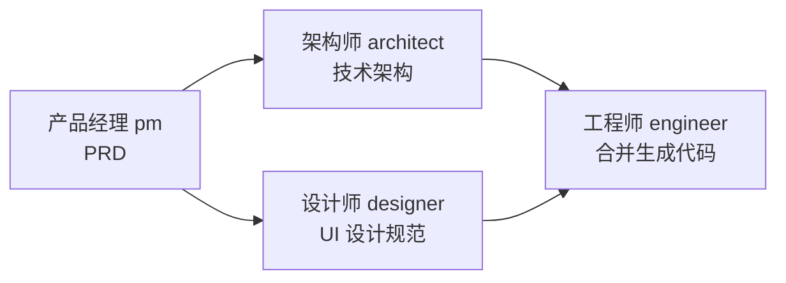
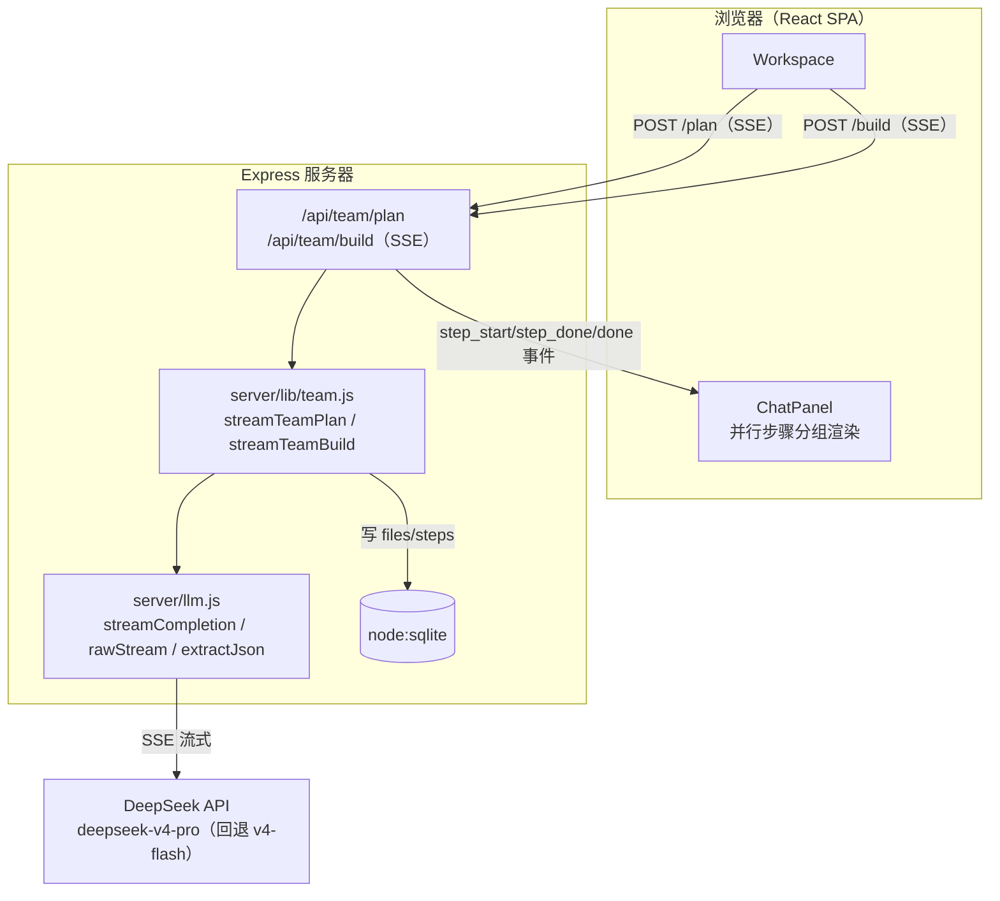
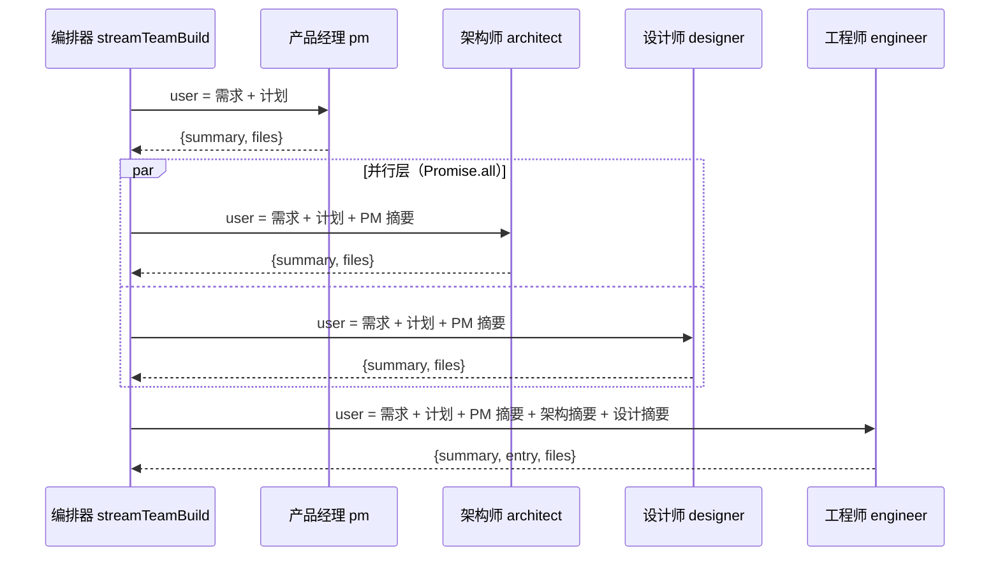

# Multi-Agent 团队模式：原理与架构

> 本文档描述 `multi-agent` 分支当前已实现的**多智能体并行流水线**（团队模式）的原理与架构。
> 实现代码：`server/lib/team.js`、`server/llm.js`、`server/routes/team.js`、`src/pages/Workspace.jsx`、`src/components/ChatPanel.jsx`。

---

## 1. 概述

团队模式把「单智能体生成单文件 HTML」升级为「多智能体协作生成多文件项目」：

```
用户一句话需求 → Team Leader 规划（可编辑确认）→ 并行流水线执行 → 多文件项目 + 预览/发布
```

核心闭环：**Leader 产出开发计划 → 用户确认 → 多智能体按固定拓扑接力执行（层内并行、层间串行）→ 各智能体产出文件与摘要 → 下游合并上游产出生成最终代码**。

---

## 2. 核心原理：固定拓扑并行流水线

当前采用**固定拓扑、层内并发**的并行流水线（尚未做 Leader 动态编排 DAG）：



- **3 个层级（level）**，层内智能体并行执行、层间严格串行。
- 每个智能体只依赖上一层（所有上游）的产出摘要；下游拿到上游摘要作为上下文。
- 层宽当前最多 2（架构师 ∥ 设计师），因此无需额外并发上限控制。

拓扑在 `server/lib/team.js` 中以**层级数组**静态表达：

```js
const TEAM_PIPELINE = [
  [{ id: 'pm',        agent: 'pm',        task: '整理产品需求文档' }],
  [
    { id: 'architect', agent: 'architect', task: '输出技术架构方案' },
    { id: 'designer',  agent: 'designer',  task: '输出 UI 设计规范' }
  ],
  [{ id: 'engineer',  agent: 'engineer',  task: '生成项目代码' }]
]
```

`id` 是步骤的唯一标识（供前端定位状态），`agent` 对应 `TEAM_AGENTS` 中的角色，`task` 是展示与落库用的任务描述。

---

## 3. 架构总览



关键模块职责：

| 模块 | 职责 |
|------|------|
| `server/routes/team.js` | 两阶段 HTTP 接口（规划 / 构建），SSE 响应头 + 事件转发 |
| `server/lib/team.js` | 并行流水线编排：`streamTeamPlan`（Leader 规划）+ `streamTeamBuild`（层级调度执行） |
| `server/llm.js` | LLM Provider 抽象层：流式调用、冗长推理看门狗、JSON 稳健解析、各智能体 system prompt |
| `server/db.js` | 持久化：`apps` / `files` / `steps` / `messages` / `app_data` |
| `src/pages/Workspace.jsx` | 团队模式状态机 + SSE 事件消费 |
| `src/components/ChatPanel.jsx` | 并行步骤按层级分组渲染 |

---

## 4. 智能体团队

`src/data/agents.js` 定义了 8 个角色，团队模式实际使用其中 5 个：

| 角色 | id | 名称 | 在流水线中的职责 |
|------|----|------|-----------------|
| 团队组长 | `leader` | 迈克 | 规划：拆解需求为开发计划（只规划、不执行） |
| 产品经理 | `pm` | 艾玛 | 输出 PRD（`docs/requirements.md`） |
| 架构师 | `architect` | 鲍勃 | 输出技术架构方案（`docs/architecture.md`） |
| 设计师 | `designer` | 露娜 | 输出 UI 设计规范（`docs/design.md`），与架构师**并行** |
| 工程师 | `engineer` | 亚历克斯 | 合并上游摘要，生成完整项目代码 |

> `designer` 为并行流水线新增接入的角色；`research` / `data` / `qa` 仍定义未接入。

### 4.1 统一输出契约

除 `leader` 外，每个执行智能体的 system prompt 都要求输出**严格 JSON**：

```json
{ "summary": "本步骤一句话摘要", "files": [ { "path": "docs/xx.md", "content": "..." } ] }
```

- `summary`：本步骤产出摘要，作为下游智能体的上下文（**只传摘要，不传全文**，控制上下文长度）。
- `files`：本步骤产出的项目文件（路径 + 内容）。
- `engineer` 额外输出 `entry` 字段，指定预览入口文件（默认 `frontend/index.html`）。

### 4.2 角色识别与兜底

`getTeamAgent(agent)` 返回对应角色的 `{ name, system }`，未知 id 兜底回退到 `engineer`：

```js
export function getTeamAgent(agent) {
  return TEAM_AGENTS[agent] || TEAM_AGENTS.engineer
}
```

---

## 5. 执行引擎：层级调度

`streamTeamBuild` 是核心编排器（异步生成器）。调度算法：

```
for 每个 level（0..N-1）:
  1. 对层内每个 step 产出 step_start 事件
  2. await Promise.all(层内所有 runStep)   ← 层内并发
  3. 对每个结果产出 files + step_done 事件
     记录 summaries[step.id] = summary（供下游使用）
     若结果带 entry 则记录
产出 done 事件（entry + 全部文件）
```

单步执行 `runStep`：

```
组装上下文：需求 + 团队计划 + 上游摘要（Object.values(summaries) 拼接）
调用 complete(def.system, user)  → 累积 LLM 输出
extractJson 解析 → { summary, files, entry? }
写 files 表（INSERT OR REPLACE）+ steps 表（seq = level + 1）
返回 { id, agentId, summary, files, entry }
```

### 5.1 并行与串行的边界

- **层内并行**：`Promise.all` 同时发起架构师与设计师的 LLM 调用，两个分支重叠执行。
- **层间串行**：engineer 的 `runStep` 只有在上一层的 `Promise.all` resolve、摘要写入 `summaries` 之后才会执行。
- 由于 `improve` 分支已隐藏思考正文（`complete()` 只转发 `turn_done`），并行时 SSE 不会出现文本交错，事件流保持干净。

### 5.2 上下文传播

`summaries` 对象以步骤 id 为键，累积所有已完成步骤的摘要。下游智能体通过 `Object.values(summaries)` 拿到**全部上游摘要**（按完成顺序），拼接到 user 消息：

```
需求：{prompt}
团队计划：{plan}

上游产出摘要：
{pm 摘要}
{architect 摘要}
{designer 摘要}
```

层内各步骤在同一层执行时只看到上一层（及更早）的摘要——因为它们启动时本层摘要尚未写入。

---

## 6. 智能体实现与通信机制

### 6.1 单个智能体如何实现

每个执行智能体（pm/architect/designer/engineer）本质上是**一次独立的、无状态的 LLM 调用**：

```
独立 LLM 调用 = system prompt（角色人设 + 输出契约）+ user 消息（需求 + 计划 + 上游摘要）
                 ↓ 流式补全（streamCompletion）
        结构化 JSON 输出（{ summary, files[, entry] }）
```

- **system prompt** 定义在 `server/llm.js` 的 `TEAM_AGENTS`，写死该角色的职责与严格 JSON 输出格式，各角色互相独立。
- **无状态**：每次调用不携带任何会话记忆，所有「协作所需信息」都由编排器显式注入到 user 消息里。
- **独立上下文**：每个 agent 的输入只包含它需要的信息（需求 + 计划 + 它依赖的上游摘要），不共享其它 agent 的完整历史与思考。
- **统一出口**：`extractJson` 把流式输出解析为结构化对象；`complete()` 只透传最终 `turn_done`，隔离流式细节。

### 6.2 智能体之间如何通信

当前实现中，**智能体之间不直接通信**，而是由**编排器（`streamTeamBuild`）作为唯一中介**，做**单向、沿依赖方向**的摘要传递：



通信的载体（按层次）：

| 载体 | 机制 | 说明 |
|------|------|------|
| **JSON 输出契约** | 每个 agent 的 system prompt 强制输出严格 JSON | agent 只通过结构化字段「说话」，不自由发挥 |
| **摘要传递（核心）** | 编排器把上游 `summary` 拼进下游 user 消息 | 只传一句话摘要、不传全文，控制上下文长度 |
| **文件产物** | 每个 agent 的 `files` 写入 `files` 表 | 产物持久化供预览/导出；下游主要靠摘要，不直接读文件 |

### 6.3 通信实现细节（代码路径）

1. 编排器在内存维护 `summaries` 对象（`server/lib/team.js`），以步骤 id 为键：

   ```js
   const summaries = {}  // stepId -> summary
   ```

2. 每个 `runStep` 执行时，通过 `Object.values(summaries)` 读取**所有已完成上游**的摘要，拼进 user 消息：

   ```js
   const upstream = Object.values(summaries).filter(Boolean)
   let user = `需求：${prompt}\n团队计划：\n${plan}`
   if (upstream.length) user += `\n\n上游产出摘要：\n${upstream.join('\n')}`
   ```

3. 每层执行完成后，编排器把该层各步骤的 `summary` 写回：

   ```js
   summaries[r.id] = r.summary
   ```

4. **依赖保证**：因「层间串行」（下一层的 `Promise.all` 只有上一层 resolve 后才启动），下游读取 `summaries` 时，它依赖的上游摘要必定已写入，不会读到空值。

### 6.4 明确的边界（当前没有的）

- **无 function calling / tool call**：agent 不能主动调用别的 agent 或写文件，一切由编排器代劳。
- **无 @mention / 自由编排**：拓扑固定，agent 不能决定调用谁。
- **无共享记忆 / 白板**：agent 之间唯一的显式信息通道是编排器注入的摘要，无隐藏状态。
- **无多轮内部对话**：每个 agent 只有一次 user 输入、一次 JSON 输出，不进行追问/澄清。

> 这种「编排器 + 摘要传递」是 function calling 自由编排到来前，最可控、可测试的多智能体协作方式——通信协议被压缩成一条「摘要」，既保证下游有足够上下文，又避免 prompt 无限膨胀。

---

## 7. 数据模型

沿用 `server/db.js` 的既有表，**并行流水线无需改 schema**：

| 表 | 用途 | 关键字段 |
|----|------|---------|
| `apps` | 应用主表 | `id` / `mode`('single'|'team') / `status` / `plan` / `entry` / `published` |
| `files` | 项目产物文件 | `app_id` / `path` / `content` / `kind`，`UNIQUE(app_id, path)` |
| `steps` | 智能体执行步骤记录 | `app_id` / `seq` / `agent_id` / `agent_name` / `task` / `status` / `output` |
| `messages` | 对话历史 | `role` / `content` / `thinking` |
| `app_data` | 生成应用的持久化数据（AtomsData 桥） | `app_id` / `key` / `value` |

> **`steps.seq` 复用为层级号**（pm=1，architect/designer=2，engineer=3）。该表是**只写记录**（详情接口不返回它），仅用于审计，不驱动前端渲染——前端用 SSE 事件的 `id` 定位步骤状态。

---

## 8. 两阶段 API 与 SSE 事件流

### 8.1 阶段一：Leader 规划

```
POST /api/team/plan   body: { prompt, userId?, appId? }
```

流程：新建/复用 `apps` 行（`mode='team'`, `status='planning'`）→ `streamTeamPlan` 调用 Leader → 落 `plan` + `status='awaiting_confirm'`。

SSE 事件：`done_plan { id, title, plan }`

### 8.2 阶段二：并行构建

```
POST /api/team/build   body: { appId, plan? }
```

流程：`status='building'` → 逐层执行 → `status='done'` + 落 `entry` + 写对话消息。

SSE 事件（顺序即层级推进）：

| 事件 | 载荷 | 说明 |
|------|------|------|
| `step_start` | `{ id, level, agentId, agentName, task }` | 某步骤启动；层内多个 `step_start` 连续发出 |
| `files` | `{ files: [{ path, content }] }` | 某步骤产出的文件（前端当前不消费，仅 `done` 汇总） |
| `step_done` | `{ id, level, agentId, summary }` | 某步骤完成 |
| `done` | `{ entry, files }` | 全部完成，携带入口文件与全部产物 |

### 8.3 事件时序（并行层）

```
step_start(pm)
step_done(pm)
step_start(architect)   ┐
step_start(designer)    ┘   ← 同层两个 start 连续发出（并行）
step_done(architect)    ┐
step_done(designer)     ┘
step_start(engineer)
step_done(engineer)
done
```

---

## 9. 前端渲染

- **状态流**（`src/pages/Workspace.jsx` `confirmBuild`）：
  - `step_start` → 追加 `{ id, level, agentId, agentName, task, status:'running' }`
  - `step_done` → 按 `id` 将对应步骤置为 `done`
  - `done` → 设置文件树 / 入口 / 打开标签页
- **并行分组**（`src/components/ChatPanel.jsx` `groupSteps`）：把连续同 `level` 的步骤归为一组，组内多于 1 项时显示「⚡ 并行」标识并加左侧高亮边（`src/styles.css` 的 `.step-group.parallel`）。

> 步骤身份从原来的 `seq` 改为 `id`：并行下两个步骤可能同层级，`seq` 不再唯一，按 `seq` 匹配 `step_done` 会误标两个步骤。

---

## 10. 关键设计决策

1. **固定拓扑而非动态编排 DAG**：完整的多智能体自由编排需要 function calling + 任务 DAG + 依赖解析，复杂度高、收敛难；固定「pm → architect∥designer → engineer」并行流水线在「体现多智能体分工协作 + 层内并行」与「可控、可测试」之间取平衡。
2. **摘要而非全文传递**：下游只拿上游 `summary`（一句话），控制上下文长度、避免 prompt 膨胀。
3. **不改 DB schema**：`steps` 本就是只写记录，`seq` 复用为层级号；前端靠 SSE 事件 `id` 定位。
4. **层内无并发上限**：当前层宽 ≤ 2，无需额外 `CONCURRENCY` 控制；未来增加并行角色时再引入。
5. **并行分支选 designer**：`agents.js` 已定义未接入的角色里，设计师与架构师同依赖 PM、可并行，是最自然的选择。
6. **思考正文隐藏**：团队模式只展示「谁在思考 + 已用时」而非正文，保证并行时 SSE 无文本交错。

---

## 11. 稳定性工程（Provider 抽象层）

`server/llm.js` 提供与业务解耦的 LLM 调用层：

- `rawStream`：底层 DeepSeek 流式调用（SSE 逐块），`temperature=0`、`response_format=json_object`，带 180s 超时。
- **冗长推理看门狗**：推理长度超过阈值（`maxReasoning=10000`）且正文仍为空时抛 `VerboseReasoningError`，自动回退到 `FALLBACK_MODEL`（默认 `deepseek-v4-flash`）重试，避免推理模型卡死。
- `extractJson`：稳健 JSON 提取（直接 JSON / `---` 前缀 / markdown 代码块 / 包裹文本），兜底正则。
- `getTeamAgent`：未知角色兜底 engineer。

---

## 12. 扩展方向（按优先级）

1. **Leader 动态编排 DAG**：把固定拓扑升级为 Leader 按需求动态生成任务依赖图，按依赖调度、支持任意并行分支与角色选择。
2. **接入剩余角色**：`research`（深度研究）、`data`（数据分析）、`qa`（质检），并把 QA 做成自动验证修复闭环。
3. **函数调用自由编排**：把「委托智能体」「读写文件」建模为 DeepSeek tool call，智能体自主决定调用谁。
4. **层内并发上限**：并行角色增多后引入 `CONCURRENCY` 有界并发，控制 API 压力与成本。
